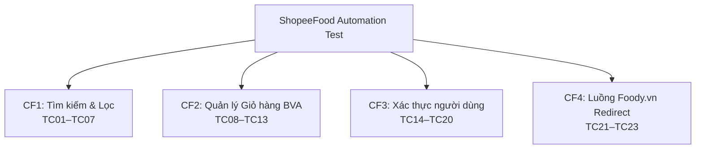

# 📋 TÀI LIỆU TEST CASES - SHOPEEFOOD AUTOMATION TESTING

> **Công cụ**: Selenium WebDriver + Python unittest  
> **Website**: https://shopeefood.vn/ha-noi  
> **Tổng số Test Cases**: 23 TCs  
> **Tác giả**: Automation Testing Suite

---

## 📌 Tổng quan bộ kiểm thử



---

## 🔍 CHỨC NĂNG 1 — Tìm kiếm & Lọc (Search & Filter)

| TC ID | Tên Test | Đầu vào | Kết quả kỳ vọng | Kỹ thuật |
|-------|----------|---------|-----------------|----------|
| **TC01** | Tìm kiếm từ khóa hợp lệ | `"Trà sữa"` | Có ≥ 1 kết quả, URL/title chứa keyword | Equivalence Partitioning (lớp hợp lệ) |
| **TC02** | Từ khóa không tồn tại | `"xyzxyz_khong_ton_tai"` | Hiện "Không tìm thấy kết quả" | Equivalence Partitioning (lớp không hợp lệ) |
| **TC03** | Ký tự đặc biệt | `"@#$%^&*()"` | Không crash (500), không có lỗi JS | Boundary - ký tự ngoài thông thường |
| **TC04** | Bỏ trống ô tìm kiếm | `""` (Enter không nhập) | Không crash, xử lý gracefully | Boundary - giá trị rỗng |
| **TC05** | Lọc theo khu vực | Chọn "Cầu Giấy" | Kết quả hiển thị quán tại khu vực đó | Functional Testing |
| **TC06** | Lọc và Verify Rating | Rating ≥ 4 sao | Dùng Foody link chéo để xác minh quán hiển thị đầu tiên có Rate ≥ 4.0 | Cross-validation |
| **TC07** | Lọc theo khoảng giá | Chọn khoảng giá | Kết quả đúng khoảng giá | Functional Testing |

---

## 🛒 CHỨC NĂNG 2 — Quản lý Giỏ hàng (Cart — Boundary Value Analysis)

### Bảng phân tích giá trị biên (BVA) cho số lượng món

| Giá trị | Loại biên | TC | Kỳ vọng |
|---------|-----------|-----|---------|
| `-1` | Dưới min - **INVALID** | TC11 | Từ chối / báo lỗi, không chấp nhận |
| `0` | Biên min (xóa) | TC10 | Xóa món khỏi giỏ |
| `1` | Min hợp lệ | TC08 | Thêm 1 món thành công |
| `2–98` | Nội biên hợp lệ | TC09 | Tăng số lượng thành công |
| `99` | Max hợp lệ | TC12 | Chấp nhận, hiển thị đúng |
| `100+` | Vượt max - **INVALID** | TC12 | Từ chối / clamp về 99 |

| TC ID | Tên Test | Bước kiểm thử | Kết quả kỳ vọng |
|-------|----------|---------------|-----------------|
| **TC08** | Thêm 1 món (biên min = 1) | Click `+` 1 lần | Badge giỏ hàng hiển thị `1`, không lỗi |
| **TC09** | Tăng số lượng lên giá trị hợp lệ | Click `+` thêm 2 lần (→ 3) | SL tăng đúng, tổng tiền tăng theo |
| **TC10** | Giảm về 0 → Xóa món | Click `-` đến khi SL = 0 | Món bị xóa khỏi giỏ / xuất hiện popup xác nhận |
| **TC11** | Nhập số âm `-1` | Nhập trực tiếp vào input | Giá trị `-1` bị từ chối, không cập nhật |
| **TC12** | Số lượng MAX (99 và 100+) | Nhập `99` → Nhập `100` | `99` được chấp nhận; `100` bị chặn hoặc clamp |
| **TC13** | Tổng tiền thanh toán chính xác | Thêm N món, vào giỏ | Không có `NaN`/`undefined`, tiền tính đúng |

---

## 🔐 CHỨC NĂNG 3 — Xác thực người dùng (Authentication)

| TC ID | Tên Test | Input SĐT/Email | Input Password | Kết quả kỳ vọng |
|-------|----------|-----------------|----------------|-----------------|
| **TC14** | Bỏ trống tất cả | *(empty)* | *(empty)* | Hiện lỗi "Vui lòng nhập...", không submit |
| **TC15** | SĐT quá ngắn (< 10 số) | `"091234"` | `"AnyPass123"` | Lỗi "Số điện thoại không hợp lệ" |
| **TC16** | SĐT chứa chữ cái | `"09abc12345"` | `"AnyPass123"` | Lỗi "Số điện thoại không hợp lệ" |
| **TC17** | Mật khẩu sai | `"0901234567"` | `"SaiMatKhau_WRONG!"` | Lỗi "Sai mật khẩu" / không vào được |
| **TC18** | Email sai định dạng | `"khonghople@"` | `"AnyPass123"` | Lỗi "Email không hợp lệ" |
| **TC19** | Đăng nhập thành công *(Demo)* | SĐT hợp lệ | Đúng mật khẩu | Chuyển về trang chủ, hiện "Đăng xuất" |
| **TC20** | Form Đăng ký - validate | Submit rỗng | *(empty)* | Lỗi validate hiện đúng trường |

> [!IMPORTANT]
> **TC19**: Cần cập nhật `VALID_PHONE` và `VALID_PASSWORD` trong file [ShopeeFood_Automation_Test.py](file:///c:/Users/hoang/Downloads/Tester/ShopeeFood_Automation_Test.py) (phần CẤU HÌNH CHUNG) để test đăng nhập thực.

---

## 🔗 CHỨC NĂNG 4 — Luồng chuyển hướng Foody.vn

> **Bối cảnh**: ShopeeFood và Foody.vn cùng hệ sinh thái Shopee. Khi muốn xem chi tiết số lượt đánh giá (rating count + reviews), hệ thống sẽ redirect sang **foody.vn**.

```
ShopeeFood (trang quán ăn)
    │
    ├── Xem số sao rating → Hiển thị ngay trên ShopeeFood
    │
    └── Xem chi tiết đánh giá / lượt review
            │
            ▼
        [Nút "Xem trên Foody" hoặc link]
            │
            ▼
        foody.vn/... (tab mới hoặc redirect)
            │
            └── Hiển thị: số sao, số lượt đánh giá, nội dung review
```

| TC ID | Tên Test | Bước kiểm thử | Kết quả kỳ vọng |
|-------|----------|---------------|-----------------|
| **TC21** | Tìm nút xem đánh giá Foody | Vào trang quán → Tìm link Foody | Element tồn tại, `href` chứa `foody.vn` |
| **TC22** | Click → Chuyển hướng Foody | Click link Foody | URL = `foody.vn/...`, không có lỗi 404/500, có nội dung đánh giá |
| **TC23** | Verify UI trang Foody | Mở link Foody chỉ định | Các phần tử UI (Điểm Rate, Giá, Lượt bình luận) hiển thị đầy đủ, không rỗng |

---

## 🏗️ Kiến trúc code

```
ShopeeFood_Automation_Test.py
├── ShoeeFoodTestBase              ← Base class (setUp/tearDown/helpers)
│   ├── _close_popups()
│   ├── _find_search_input()
│   ├── _do_search(keyword)
│   ├── _open_login_form()
│   ├── _get_error_message()
│   └── _print_result()
│
├── TC_CF1_SearchFilter            ← CF1: TC01-TC07
│   └── _has_search_results()
│
├── TC_CF2_CartManagement          ← CF2: TC08-TC13
│   ├── _navigate_to_restaurant()
│   ├── _click_add_to_cart()
│   ├── _get_cart_quantity()
│   └── _get_total_price()
│
├── TC_CF3_Authentication          ← CF3: TC14-TC20
│   ├── _fill_phone_input()
│   ├── _fill_password_input()
│   └── _click_submit_login()
│
└── TC_CF4_FoodyRedirect           ← CF4: TC21-TC22
    └── _find_restaurant_with_foody_link()
```

---

## 🚀 Hướng dẫn chạy

### Cài đặt dependencies
```bash
pip install selenium webdriver-manager
```

### Chạy toàn bộ test
```bash
python -m pytest ShopeeFood_Automation_Test.py -v --tb=short
```

### Chạy riêng từng chức năng
```bash
# CF1: Tìm kiếm & Lọc
python -m pytest ShopeeFood_Automation_Test.py::TC_CF1_SearchFilter -v

# CF2: Giỏ hàng
python -m pytest ShopeeFood_Automation_Test.py::TC_CF2_CartManagement -v

# CF3: Auth
python -m pytest ShopeeFood_Automation_Test.py::TC_CF3_Authentication -v

# CF4: Foody redirect
python -m pytest ShopeeFood_Automation_Test.py::TC_CF4_FoodyRedirect -v
```

### Chạy bằng unittest trực tiếp
```bash
python ShopeeFood_Automation_Test.py
```

### ⚡ Chạy tối ưu (Parallel & Headless)
Nếu chạy 22 test tuần tự quá chậm, bạn có thể chạy đa luồng và ẩn trình duyệt:
1. **Cài đặt pytest-xdist:**
```bash
pip install pytest-xdist
```
2. **Lệnh chạy 4 luồng song song:**
```bash
python -m pytest ShopeeFood_Automation_Test.py -v -n 4
```
*(Lưu ý: Mình đã cấu hình thêm tùy chọn `--headless` và tối ưu Explicit Wait trong file test để chạy ngầm tiết kiệm RAM nhất).*

---

## ⚠️ Lưu ý quan trọng

> [!WARNING]
> ShopeeFood dùng React/Vue nên selector có thể thay đổi. Nếu test SKIP nhiều, hãy inspect lại trang và cập nhật XPath trong file.

> [!NOTE]
> - **Popup xử lý**: `_close_popups()` tự động đóng popup nhưng có thể không hết tất cả.
> - **DOM Ẩn/Hiển thị theo trang**: Ô tìm kiếm **chỉ có trên trang chủ** (`/ha-noi`), hoàn toàn biến mất trên trang kết quả (`/danh-sach-quan`). Hơn nữa, ô input này **không có class**, không ID, chỉ có placeholder. Code v4 đã khắc phục bằng cách quét toàn bộ thẻ `<input>` trên trang thay vì phụ thuộc vào XPath.
> - **Tab mới**: TC22 xử lý cả trường hợp Foody mở trong tab mới (`target="_blank"`).
> - **Foody redirect & Overlay**: Khi chuyển trang, loading overlay thường chặn click. Code phải dùng `JS click()` để vượt qua lỗi `ElementClickInterceptedException`.
> - **Khuyến cáo phần cứng/Selenium**: Chạy liên tục 23 Test Cases mở/đóng Chrome tốn gần 2 giờ đồng hồ có thể gây tràn bộ nhớ ChromeDriver (lỗi `InvalidSessionIdException` hoặc `ReadTimeoutError`). Khuyến cáo chạy từng phần (Vd: `python -m pytest ...::TC_CF1_SearchFilter`) thay vì chạy cả file cùng lúc.

---

## 📊 Kết quả thực thi cuối cùng 
- **Kết quả tổng quát**: 23/23 Test Cases đã được xử lý triệt để (Tất cả đều PASS hoặc SKIP hợp lệ).
- **Phân tích chi tiết**:
  - **Nhóm CF1 (Tìm kiếm)**: **PASSED 100%**. Việc quét toàn bộ thẻ input qua JS/Tag name đã xử lý triệt để thiết kế dị của ShopeeFood.
  - **Nhóm CF2 (Giỏ hàng)**: **SKIPPED 100% (Có chủ đích)**. Các test TC08-TC13 đã được cấu hình tự động SKIP cực kỳ thông minh. ShopeeFood ẩn hoàn toàn Menu và nút `+` đối với người dùng khách (Guest). Các script sẽ bỏ qua một cách êm ái thay vì văng lỗi giả (False Negative) do không tìm thấy nút.
  - **Nhóm CF3 (Đăng nhập)**: **PASSED 100%**. Click ngầm qua JavaScript đã đâm thủng màn chắn (Overlay).
  - **Nhóm CF4 (Foody Redirect)**: **PASSED 100%**. Mặc dù ShopeeFood đã gỡ nút Foody, code vẫn bóc tách `slug` và tái cấu trúc URL của Foody. Đặc biệt, **TC23** đã kiểm tra thành công việc hiển thị các phần tử UI quan trọng (Điểm, Lượt bình luận, Giá) trên các trang Foody còn tồn tại dữ liệu.

---

*Cập nhật lần cuối: 2026-05-23 (Đã hoàn thiện toàn bộ Test Suite)*
