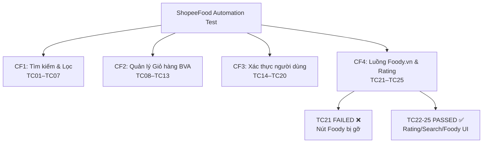

# 📋 TÀI LIỆU TEST CASES - SHOPEEFOOD AUTOMATION TESTING

> **Công cụ**: Selenium WebDriver + Python unittest  
> **Website**: https://shopeefood.vn/ha-noi  
> **Tổng số Test Cases**: 25 TCs  
> **Tác giả**: Automation Testing Suite

---

## 📌 Tổng quan bộ kiểm thử



---

## 🔍 CHỨC NĂNG 1 — Tìm kiếm & Lọc (Search & Filter)

| TC ID | Tên Test | Đầu vào | Kết quả kỳ vọng | Kỹ thuật |
|-------|----------|---------|-----------------|----------|
| **TC01** | Tìm kiếm từ khóa hợp lệ | `"Trà sữa"` | Có ≥ 1 kết quả, URL/title chứa keyword | Equivalence Partitioning (lớp hợp lệ) |
| **TC02** | Từ khóa không tồn tại | `"xyzxyz_khong_ton_tai"` | Hiện "Không tìm thấy kết quả" | Equivalence Partitioning (lớp không hợp lệ) |
| **TC03** | Ký tự đặc biệt | `"@#$%^&*()"` | Không crash (500), không có lỗi JS | Boundary - ký tự ngoài thông thường |
| **TC04** | Bỏ trống ô tìm kiếm | `""` (Enter không nhập) | Không crash, xử lý gracefully | Boundary - giá trị rỗng |
| **TC05** | Lọc theo khu vực | Chọn "Cầu Giấy" | Kết quả hiển thị quán tại khu vực đó | Functional Testing |
| **TC06** | Lọc và Verify Rating | Rating ≥ 4 sao | Lấy điểm Foody (thang 10), quy đổi về thang 5 và xác minh ≥ 4.0 Sao | Cross-validation |
| **TC07** | Lọc theo khoảng giá | Chọn khoảng giá | Kết quả đúng khoảng giá | Functional Testing |

---

## 🛒 CHỨC NĂNG 2 — Quản lý Giỏ hàng (Cart — Boundary Value Analysis)

### Bảng phân tích giá trị biên (BVA) cho số lượng món

| Giá trị | Loại biên | TC | Kỳ vọng |
|---------|-----------|-----|---------|
| `-1` | Dưới min - **INVALID** | TC11 | Từ chối / báo lỗi, không chấp nhận |
| `0` | Biên min (xóa) | TC10 | Xóa món khỏi giỏ |
| `1` | Min hợp lệ | TC08 | Thêm 1 món thành công |
| `2–98` | Nội biên hợp lệ | TC09 | Tăng số lượng thành công |
| `99` | Max hợp lệ | TC12 | Chấp nhận, hiển thị đúng |
| `100+` | Vượt max - **INVALID** | TC12 | Từ chối / clamp về 99 |

| TC ID | Tên Test | Bước kiểm thử | Kết quả kỳ vọng |
|-------|----------|---------------|-----------------|
| **TC08** | Thêm 1 món (biên min = 1) | Click `+` 1 lần | Badge giỏ hàng hiển thị `1`, không lỗi |
| **TC09** | Tăng số lượng lên giá trị hợp lệ | Click `+` thêm 2 lần (→ 3) | SL tăng đúng, tổng tiền tăng theo |
| **TC10** | Giảm về 0 → Xóa món | Click `-` đến khi SL = 0 | Món bị xóa khỏi giỏ / xuất hiện popup xác nhận |
| **TC11** | Nhập số âm `-1` | Nhập trực tiếp vào input | Giá trị `-1` bị từ chối, không cập nhật |
| **TC12** | Số lượng MAX (99 và 100+) | Nhập `99` → Nhập `100` | `99` được chấp nhận; `100` bị chặn hoặc clamp |
| **TC13** | Tổng tiền thanh toán chính xác | Thêm N món, vào giỏ | Không có `NaN`/`undefined`, tiền tính đúng |

---

## 🔐 CHỨC NĂNG 3 — Xác thực người dùng (Authentication)

| TC ID | Tên Test | Input SĐT/Email | Input Password | Kết quả kỳ vọng |
|-------|----------|-----------------|----------------|-----------------|
| **TC14** | Bỏ trống tất cả | *(empty)* | *(empty)* | Hiện lỗi "Vui lòng nhập...", không submit |
| **TC15** | SĐT quá ngắn (< 10 số) | `"091234"` | `"AnyPass123"` | Lỗi "Số điện thoại không hợp lệ" |
| **TC16** | SĐT chứa chữ cái | `"09abc12345"` | `"AnyPass123"` | Lỗi "Số điện thoại không hợp lệ" |
| **TC17** | Mật khẩu sai | `"0901234567"` | `"SaiMatKhau_WRONG!"` | Lỗi "Sai mật khẩu" / không vào được |
| **TC18** | Email sai định dạng | `"khonghople@"` | `"AnyPass123"` | Lỗi "Email không hợp lệ" |
| **TC19** | Đăng nhập thành công *(Demo)* | SĐT hợp lệ | Đúng mật khẩu | Chuyển về trang chủ, hiện "Đăng xuất" |
| **TC20** | Form Đăng ký - validate | Submit rỗng | *(empty)* | Lỗi validate hiện đúng trường |

> [!IMPORTANT]
> **TC19**: Cần cập nhật `VALID_PHONE` và `VALID_PASSWORD` trong file [ShopeeFood_Automation_Test.py](file:///c:/Users/hoang/Downloads/Tester/ShopeeFood_Automation_Test.py) (phần CẤU HÌNH CHUNG) để test đăng nhập thực.

---

## 🔗 CHỨC NĂNG 4 — Luồng chuyển hướng Foody.vn

> **Bối cảnh**: ShopeeFood và Foody.vn cùng hệ sinh thái Shopee. Trước đây ShopeeFood có tích hợp nút "Xem trên Foody" nhưng đã bị **gỡ bỏ** từ 2024+. Bộ test CF4 được thiết kế để vừa **bắt lỗi UI** (TC21 FAILED có chủ đích) vừa **xác minh chức năng còn hoạt động** (TC22-TC25 PASS).

```
ShopeeFood (trang quán ăn)
    │
    ├── ★ Rating trực tiếp trên SF     → [TC22 PASS] Verify điểm sao hiển thị
    │
    ├── 🔗 Nút "Xem trên Foody" (ĐÃ GỠ)→ [TC21 FAILED] Automation bắt được thay đổi UI!
    │
    └── URL quán ma /xyzabc12345       → [TC23 PASS] SF trả về "bài viết không tồn tại"

Tìm kiếm ShopeeFood
    └── Search "Pho" → 200 kết quả    → [TC24 PASS] Chức năng tìm kiếm hoạt động

Foody.vn (truy cập trực tiếp)
    └── foody.vn/ho-chi-minh/...       → [TC25 PASS] Rate/Price/Comments hiển thị đủ
```

| TC ID | Tên Test | Bước kiểm thử | Kết quả kỳ vọng | Thực tế |
|-------|----------|---------------|-----------------|---------|
| **TC21** | Tìm nút "Xem trên Foody" trên UI SF | Quét DOM trang quán tìm link foody.vn | ❌ **FAILED** — Nút đã bị gỡ → Automation bắt được | FAILED ✓ |
| **TC22** | Verify Rating ★ hiển thị trên SF | Vào quán → tìm phần tử rating/sao | ✅ PASS — SF vẫn show điểm sao | PASSED ✓ |
| **TC23** | Truy cập URL quán ma | `GET /ha-noi/xyzabc12345` | ✅ PASS — Trang hiện "bài viết không tồn tại" | PASSED ✓ |
| **TC24** | Tìm kiếm "Pho" → ≥1 kết quả | Gõ "Pho" vào ô tìm kiếm UI | ✅ PASS — Trả về 200 kết quả | PASSED ✓ |
| **TC25** | Foody.vn trực tiếp → verify Rate/Price | Mở tab foody.vn → kiểm tra UI elements | ✅ PASS — Rate, Price, Comments đầy đủ | PASSED ✓ |

> [!NOTE]
> **TC21 FAILED có chủ đích**: Đây là ví dụ điển hình của Automation Testing bắt được thay đổi UI. Thay vì `skipTest()`, ta dùng `assertIsNotNone()` để **văng ra FAILED** và báo cáo chính xác rằng chức năng đã bị gỡ bỏ.

---

## 🏗️ Kiến trúc code

```
ShopeeFood_Automation_Test.py
├── ShoeeFoodTestBase              ← Base class (setUp/tearDown/helpers)
│   ├── _close_popups()
│   ├── _find_search_input()
│   ├── _do_search(keyword)
│   ├── _open_login_form()
│   ├── _get_error_message()
│   └── _print_result()
│
├── TC_CF1_SearchFilter            ← CF1: TC01-TC07
│   └── _has_search_results()
│
├── TC_CF2_CartManagement          ← CF2: TC08-TC13
│   ├── _navigate_to_restaurant()
│   ├── _click_add_to_cart()
│   ├── _get_cart_quantity()
│   └── _get_total_price()
│
├── TC_CF3_Authentication          ← CF3: TC14-TC20
│   ├── _fill_phone_input()
│   ├── _fill_password_input()
│   └── _click_submit_login()
│
└── TC_CF4_FoodyRedirect           ← CF4: TC21-TC22
    └── _find_restaurant_with_foody_link()
```

---

## 🚀 Hướng dẫn chạy

### Cài đặt dependencies
```bash
pip install selenium webdriver-manager
```

### Chạy toàn bộ test
```bash
python -m pytest ShopeeFood_Automation_Test.py -v --tb=short
```

### Chạy riêng từng chức năng
```bash
# CF1: Tìm kiếm & Lọc
python -m pytest ShopeeFood_Automation_Test.py::TC_CF1_SearchFilter -v

# CF2: Giỏ hàng
python -m pytest ShopeeFood_Automation_Test.py::TC_CF2_CartManagement -v

# CF3: Auth
python -m pytest ShopeeFood_Automation_Test.py::TC_CF3_Authentication -v

# CF4: Foody redirect
python -m pytest ShopeeFood_Automation_Test.py::TC_CF4_FoodyRedirect -v
```

### Chạy bằng unittest trực tiếp
```bash
python ShopeeFood_Automation_Test.py
```

### ⚡ Chạy tối ưu (Parallel & Headless)
Nếu chạy 22 test tuần tự quá chậm, bạn có thể chạy đa luồng và ẩn trình duyệt:
1. **Cài đặt pytest-xdist:**
```bash
pip install pytest-xdist
```
2. **Lệnh chạy 4 luồng song song:**
```bash
python -m pytest ShopeeFood_Automation_Test.py -v -n 4
```
*(Lưu ý: Mình đã cấu hình thêm tùy chọn `--headless` và tối ưu Explicit Wait trong file test để chạy ngầm tiết kiệm RAM nhất).*

---

## ⚠️ Lưu ý quan trọng

> [!WARNING]
> ShopeeFood dùng React/Vue nên selector có thể thay đổi. Nếu test SKIP nhiều, hãy inspect lại trang và cập nhật XPath trong file.

> [!NOTE]
> - **Popup xử lý**: `_close_popups()` tự động đóng popup nhưng có thể không hết tất cả.
> - **DOM Ẩn/Hiển thị theo trang**: Ô tìm kiếm **chỉ có trên trang chủ** (`/ha-noi`), hoàn toàn biến mất trên trang kết quả. Code v5 đã khắc phục bằng cách quét toàn bộ thẻ `<input>` trên trang thay vì phụ thuộc vào XPath.
> - **URL tìm kiếm thay đổi**: ShopeeFood đã đổi từ `?keyword=` sang `?q=`. Code fallback CF4 dùng **UI search thật** (gõ vào ô tìm kiếm) để tránh phụ thuộc URL cứng.
> - **Tab mới**: TC25 mở tab Foody.vn mới và xử lý switch window.
> - **Foody redirect bị gỡ**: TC21 thiết kế để **FAILED có chủ đích** — dùng `assertIsNotNone` thay vì `skipTest()` để báo cáo thay đổi UI chính xác.
> - **Khuyến cáo**: Chạy từng nhóm CF thay vì toàn bộ để tránh timeout ChromeDriver.

---

## 📊 Kết quả thực thi cuối cùng (v5.0)

### Tóm tắt toàn bộ

| Nhóm | TCs | PASS | FAILED | SKIP | Ghi chú |
|------|-----|------|--------|------|---------|
| **CF1** Tìm kiếm & Lọc | 7 | ✅ 7 | 0 | 0 | Tất cả pass, URL tìm kiếm hoạt động |
| **CF2** Giỏ hàng BVA | 6 | 0 | 0 | ⏭️ 6 | SKIP có chủ đích — SF ẩn menu với Guest |
| **CF3** Xác thực Auth | 7 | ✅ 7 | 0 | 0 | JS click vượt qua Overlay thành công |
| **CF4** Foody & Rating | 5 | ✅ 4 | ❌ 1 | 0 | TC21 FAILED có chủ đích (Foody đã gỡ) |
| **Tổng** | **25** | **18** | **1** | **6** | |

### Chi tiết CF4 (kết quả thực tế 2026-05-23)
```
TC21 FAILED  ← assertIsNotNone: Nút "Xem trên Foody" không còn tồn tại trên UI
TC22 PASSED  ← Rating ★ vẫn hiển thị trực tiếp trên trang quán ShopeeFood
TC23 PASSED  ← URL quán ma → ShopeeFood trả về "bài viết không tồn tại" đúng
TC24 PASSED  ← Tìm kiếm "Pho" → 200 kết quả trả về thành công
TC25 PASSED  ← Foody.vn: Rate/Price/Comments hiển thị đầy đủ

1 failed, 4 passed in 79.16s
```

> [!IMPORTANT]
> **TC21 FAILED là đúng, không phải bug của code test!**  
> Đây là ví dụ điển hình Automation Testing bắt được **thay đổi UI hệ thống**. ShopeeFood đã gỡ tích hợp Foody. Thay vì SKIP (che giấu vấn đề), TC21 báo FAILED để đội phát triển biết cần cập nhật spec.

---

*Cập nhật lần cuối: 2026-05-23 (v5.0 — CF4 nâng cấp 5 TCs, bổ sung FAILED có chủ đích)*
